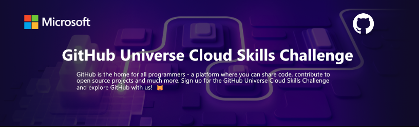

  

# GitHub Universe Cloud Skills Challenge

Welcome to the repository for the GitHub Universe Cloud Skills Challenge, a series of modules designed to help you improve your skills with Git, GitHub, and programming in general. Through this challenge, we will explore different aspects of GitHub, including creating and modifying projects, collaboration, code editing, and more. We will make extensive use of GitHub Copilot to facilitate coding in JavaScript and Python.

## 🚀 Modules

### 1. Introduction to Git
Brief description of what was learned in this module.

### 2. Procedures for Creating and Modifying a Git Project
Description of the procedures and techniques learned.

### 3. Collaboration with Git
How to collaborate efficiently with others using Git.

### 4. Code Editing by Creating Branches and Merging in Git
Techniques for code editing, branch creation, and merging changes.

### 5. Introduction to GitHub
First steps and basic concepts of GitHub.

### 6. Code with GitHub Codespaces
Use of GitHub Codespaces to write and edit code directly from the browser.

### 7. Introduction to GitHub Copilot
How to start using GitHub Copilot and its benefits. It will focus on how GitHub Copilot can help you write code more quickly and with fewer errors.

### 8. Using GitHub Copilot with JavaScript
Exploration of how GitHub Copilot integrates with JavaScript to enhance productivity in coding.

### 9. Using GitHub Copilot with Python
How to leverage GitHub Copilot to write Python code more efficiently.

### 10. Challenge Project: Create a Mini-Games Console Application with GitHub Copilot
Description of the project, objectives, and what was learned during development. GitHub Copilot will be used to streamline code writing in JavaScript.

### 11. Challenge Project: Add Image Generation and Analysis Features to the Application
Description of the project, objectives, and techniques used for image generation and analysis. GitHub Copilot will be used to facilitate code writing in Python for these functionalities.

## 📚 Course Description
GitHub is home for all programmers, a platform where you can share code, contribute to open source projects, and much more. This challenge is a perfect opportunity to explore GitHub and improve your software development skills, with a special emphasis on using GitHub Copilot for JavaScript and Python.

## 🤝 Collaboration
If you are interested in collaborating or have any questions, please feel free to open an issue or send a pull request.

## 🎁 Acknowledgments
I want to express my heartfelt thanks to GitHub and Microsoft for offering this free challenge. It has been an incredibly enriching experience and a fantastic opportunity to learn and improve our skills in software development, Git, and GitHub.

This challenge has not only provided valuable learning resources but has also fostered a community environment where developers from all around the world can come together, collaborate, and share knowledge. We are grateful for GitHub and Microsoft's commitment to education and professional development, and I am excited to be a part of this learning community.

Thank you GitHub and Microsoft for making this challenge possible and for your ongoing support to the developer community!

---

with ❤️ by [Miguel Ardila](https://github.com/miguel-ardila)😊
